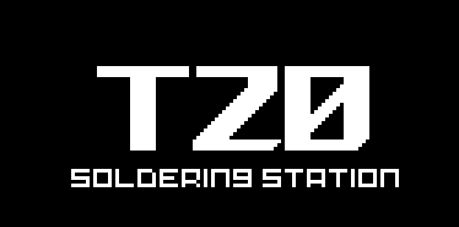

 
## T20焊台控制器

 工欲善其事，必先利其器。
这个开源项目使用STM32F103C8T6-BluePill（8元包邮）来制作T12焊台控制器，助你拥有一个得心应手的焊台！！！ 
此控制器命名为T20，和J20航模遥控器做成一个系列，20也象征着开发时间。 
原理图部分主要参考了sfrwmaker的开源仓库https://github.com/sfrwmaker/hakko_t12_stm32 
程序部分使用keil5和stm32标准库编写，PID参数是白嫖的wagiminator的开源仓库https://github.com/wagiminator/ATmega-Soldering-Station 
- QQ群：1091996634，密码：J20
- 教程：https://www.cnblogs.com/cai-zi/p/13812306.html
## 元件清单(BOM)
- （1）T12烙铁头（焊贴片用刀头，焊插件用尖头）
- （2）烙铁手柄（笔者买的907手柄）、硅胶线（5线）、烙铁支架（带NTC电阻10k、震动开关）、航插（5线）
- （3）24V4A开关电源，给烙铁供电 
https://item.taobao.com/item.htm?spm=a1z10.3-c-s.w4002-21223910208.33.17fc6a4bl5eVUy&id=560319416660
- （4）DC-DC降压模块，24V转5V，给控制板供电 
https://item.taobao.com/item.htm?spm=a1z10.3-c-s.w4002-21223910208.19.34f96a4bHIEpSp&id=536347025767
- （5）旋转编码器 
https://item.taobao.com/item.htm?spm=a1z10.3-c-s.w4002-21223910208.9.7d2b6a4bBVyIM1&id=532637569029
- （6）OLED显示屏（7脚SPI） 
https://item.taobao.com/item.htm?spm=a1z10.3-c-s.w4002-21223910208.22.6b146a4bQeIpQy&id=562145367495
- （7）STM32F103C8T6最小系统板
- （8）IRF9540 MOS管P沟道，驱动电烙铁的 
https://item.taobao.com/item.htm?spm=a1z10.3-c-s.w4002-21223910208.9.901e6a4b9iiE0a&id=522575402372
- （9）SS8050三极管
- （10）肖特基二极管（用来续流）
- （11）运算放大器LM358，笔者用的AD823，两者都是可以的
- （12）3.3v稳压管 
https://item.taobao.com/item.htm?spm=a1z10.3-c-s.w4002-21223910208.35.be596a4bDZ94Ne&id=580234927158
- （13）18v稳压管 
https://item.taobao.com/item.htm?spm=a1z10.3-c-s.w4002-21223910208.18.52186a4brkOWGF&id=580243199645
- （14）电解电容100uF（用来稳压）
- （15）独石电容0.1uF（用来滤波），又称104电容 
- （16）有源蜂鸣器5V的（接电即响） 
- （17）470Ω、1k、51k、10k、100k电阻若干
- （18）500k可调电阻 
https://item.taobao.com/item.htm?spm=a1z10.3-c-s.w4002-21223910208.12.7cc76a4bofuOr0&id=522572774132
- （19）ST-LINK V2下载器 
调试STM32性价比极高，可烧写程序，可断点调试
## 引脚说明
- OLED_D0  -> PB13
- OLED_D1	 -> PB15
- OLED_RES -> PB15
- OLED_DC -> PB11
- OLED_CS -> PB12
- BM_CLK -> PB0
- BM_DT  -> PB3
- BM_SW  -> PB1
- BEEPER -> PB9
- NTC 	  -> PA6
- T12_ADC -> PA4
- HEAT 	  -> PA0
- SLEEP 	-> PA8
- TX -> PA9
- RX -> PA10
## 版本说明
- V1.0(2020.10.20) 
配套的T12烙铁头为S型热电偶，如果是其他类型的热电偶，需要更改程序中的分度表； 
已完成的功能包含设置温度、自动休眠、自动关机、蜂鸣器开关、恢复默认设置； 
在home页面时，短按旋转编码器设置加热开关，长按进入菜单，旋转设置加热温度； 
在菜单页面时，短按进入选择，再短按退出，旋转设置参数，长按退出菜单。 
- V1.1(2020.11.3) 
实际测试发现T12烙铁里面的热电偶与S型不符（更不符合其他类型），使用万用表的温度计校准了分度表，读者可自行设置校准值； 
使用USB-TTL串口下载器和串口调试助手(115200bps)读取ADC值，然后更改adc.c文件中的TEMP100、TEMP200、TEMP300、TEMP420即可； 
实际使用中温度的波动在30℃左右，焊接时设置280℃即可。 
- V1.2(2020.11.5) 
参考wagiminator的PID控制方式，将PWM更新频率由10Hz提高到390Hz，细分数由100提高到255； 
使用分段式PID：温差>100℃时，全速加热；温差30~100℃时，激进的PID；温差<30℃时，保守的PID； 
得到的温度非常稳定！！！焊接大焊点时，波动在10℃左右。 
读者可自行使用万用表的温度计校准分度表：使用USB-TTL串口下载器和串口调试助手(115200bps)读取100℃、200℃、300℃、420℃时的ADC值， 
然后更改main.h文件中的TEMP100、TEMP200、TEMP300、TEMP420即可； 
- V1.3(2020.11.16) 
修复旋转编码器检测不到旋转方向问题； 
增加输入电压检测，原理图做了相应修改； 
home界面增加输入电压显示，加热力度百分比显示； 
## THANKS
感谢简繁的UI设计~
